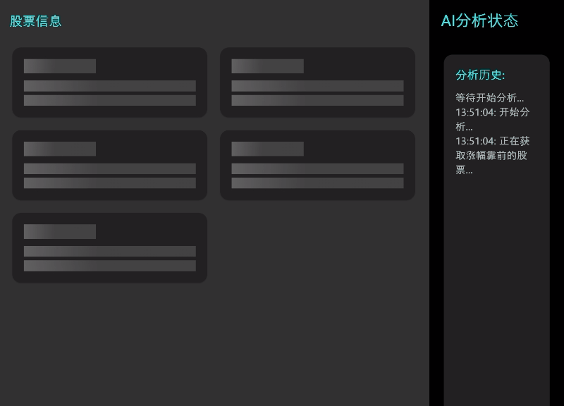
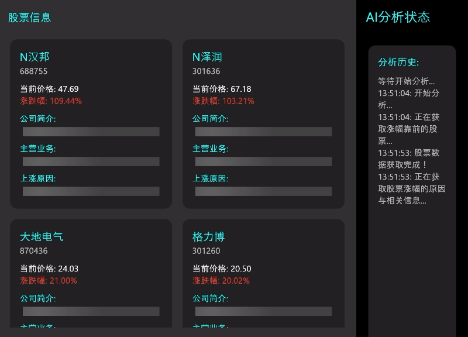

# Stock AI Agent

自动获取当天涨幅靠前的股票，并且展示公司背景和分析股票上涨原因

## 主要用途

本 AI agent 旨在辅助投资者高效了解当日A股市场中涨幅居前的股票。它能够自动获取涨幅靠前的个股数据，并结合公司基本面信息，分析其上涨原因，如利好公告、行业政策、资金流入等，帮助用户快速把握市场热点、识别潜在投资机会，从而提升投资决策效率。

## 应用截图

## 架构

